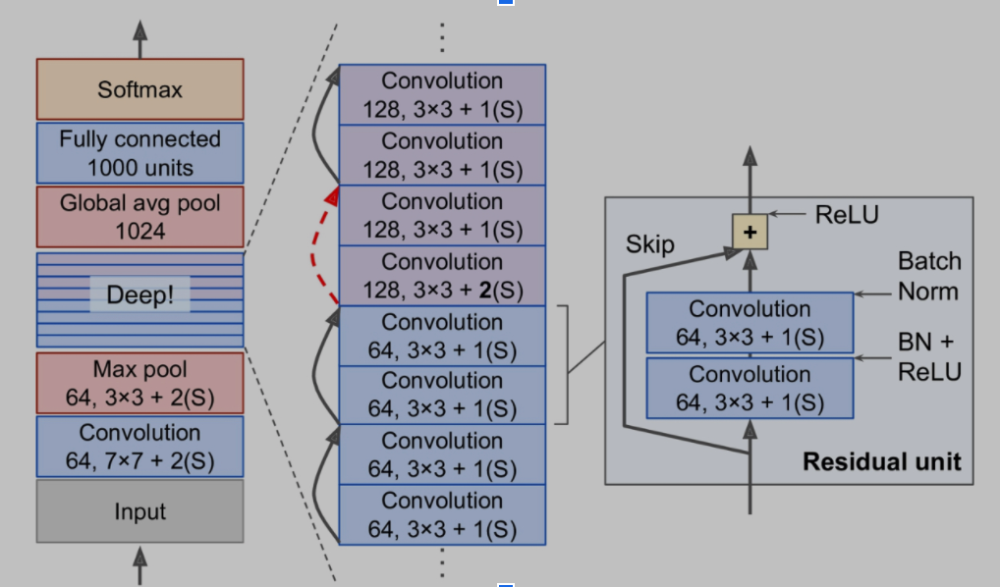

# w251-final-project
Code for the final project

## Edge
To run the edge code, please follow the bash code here: https://github.com/sthiruvallur/w251-final-project/blob/develop/Edge/bashcode

## Cloud

### VGG-16 Transfer Learning

* VGG-16 so named for its 16 trainable layers ( 13 convolution + 3 dense layers)
* The model was imported Keras applications
* Pre-trained model weights was obtained from F.Chollet's github: [F.Chollet's github](https://github.com/fchollet/deep-learning-models/releases)
* The images from ASL dataset was sized down into 50X50 and trained for 10 epochs
* Notebook and standalone python script is available under Cloud/Models/VGG16/

### ResNet50 Transfer Learning
* ResNet-50 model pretrained on ImageNet and imported from the Keras applications.
* Creates the ResNet-50 model and downloads the weights pretrained on the ImageNet dataset.
* ResNet-50 expects the images to be 224 x 224 pixels in size so we used the tf.image.resize() function to resize our images
* ImageDataGenerator to load the images and augment them in various ways.

